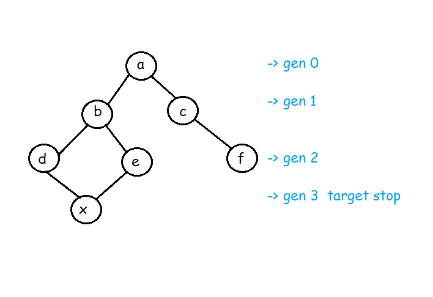

# Generation walk using BFS

First explor current generation all nodes ,then explor next generation.


## Explanation



  
## code

```javascript
	int minStepToReachTarget(vector<int>&KnightPos, vector<int>&TargetPos, int N){
	    // Code here
	    vector<vector<bool>> visited(N,vector<bool>(N,false));
	    
	    static int dr[] = {2,2,-2,-2,1,-1,1,-1};
	    static int dc[] = {1,-1,1,-1,2,2,-2,-2};
	    
	    queue<pair<int,int>> q;
	    q.push(MP(KnightPos[0]-1,KnightPos[1]-1));
	    
	    visited[KnightPos[0] -1][KnightPos[1] -1] = true;
	    
	    int gen = 0;
	    
	    while(!q.empty())
	    {
	        
	        int genwalk = q.size();
	        for(int i = 0;i<gen;i++)
	        {
	            pair<int,int> p = q.front();
	            q.pop();
	            
	            if(p.F == TargetPos[0] -1 && p.S == TargetPos[1] -1) return ans;
	            for(int k = 0;k<8;k++)
	            {
	                int x = p.F+dr[k];
	                int y = p.S+dc[k];
	                if(x>=0 && x<N && y>= 0 && y<N && !visited[x][y])
	                {
	                    q.push(MP(x,y));
	                    visited[x][y] = true;
	                }
	            }
	        }
	        
	        gen++;l
	    }
	    
	    return -1;
	    
	}
```

  
