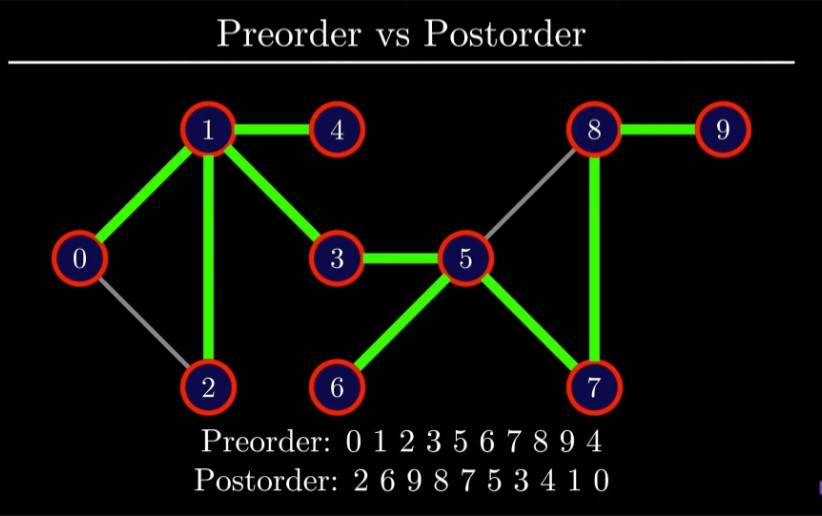

# Post order

If node's all edge is visited the push it on Post order array.


## Postorder of graph using DFS

```javascript
vector<vector<int>> adj; // graph represented as an adjacency list
int n; // number of vertices

vector<bool> visited;
vector<bool> Postorder;

void dfs(int v) {
    visited[v] = true;
    for (int u : adj[v]) {
        if (!visited[u])
            dfs(u);
    }
    Postorder.push_back(v);
}
```

  
## Screenshots



# Topological sort

- Topological sorting for Directed Acyclic Graph (DAG) is a linear ordering of vertices such that for every directed edge u v, vertex u comes before v in the ordering. Topological Sorting for a graph is not possible if the graph is not a DAG.

- Reverse of Post ordre = Topological sort

  
